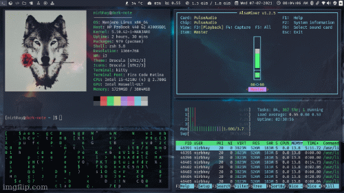
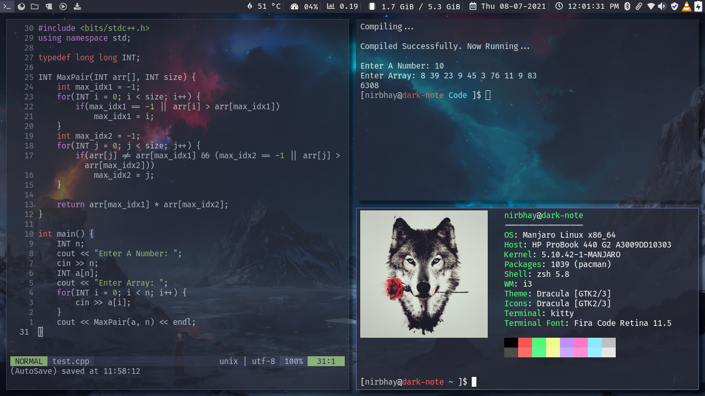
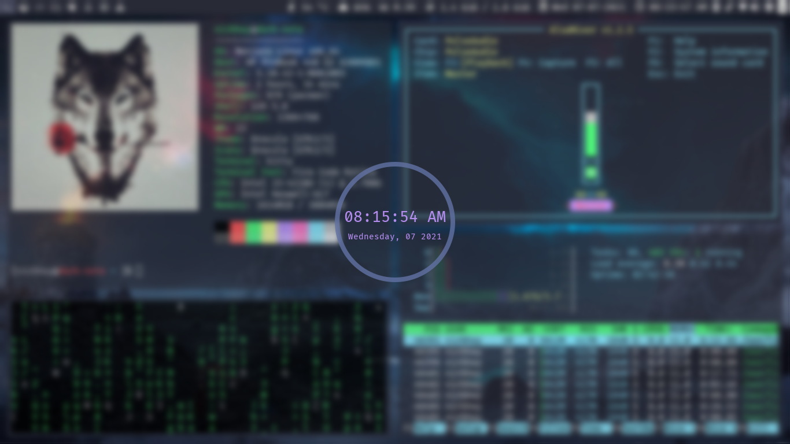
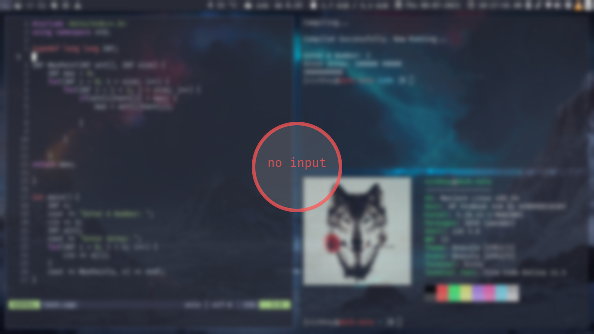

<h1>Alioth dotfiles</h1>

<strong>Alioth is an arch linux rice customized with dracula theme running on manjaro i3 community edition</strong>

   
  
<strong>Screenshots</strong>

  
  
  
  

<h2>Prerequisites</h2>

Install the following packages: 

<li><code>i3lock-color</code></li>
<li><code>i3-status</code></li>
<li><code>rofi</code></li>
<li><code>picom</code></li>
<li><code>neovim</code></li>
<li><code>kitty</code></li>
<li><code>dunst</code></li>
<li><code>ttf-fira-code</code></li>
<li><code>nerd-fonts-source-code-pro</code></li>
<li><code>ttf-font-awesome</code></li>
 

<strong>NOTE: </strong><em>Assuming that manjaro i3 community edition is running on the system, most of the above packages might be already installed. To check if a package is installed: </em><code>sudo pacman -Q | grep PACKAGE_NAME</code>

<h2>Installation</h2>

<strong>Manual</strong>

<li>Install the requirements.</li>
<li>Clone this repository: <code>git clone https://github.com/Nirbhay-Gaur/dotfiles/tree/master/alioth.git && cd alioth</code></li>
<li>Copy all the files from alioth directory to $HOME directory: <code>cp * $HOME/</code></li>
<li>Restart your computer for changes to take effect</li>
 

<strong>Using install.sh</strong>

<li>Install the requirements.</li>
<li>Clone this repository: <code>git clone https://github.com/Nirbhay-Gaur/dotfiles/tree/master/alioth.git && cd alioth</code></li>
<li>Run the installation script: 
<code>
sudo chmod +x install.sh
./install.sh
</code>
</li>

<h2>About</h2>

<table>
 <tr>
  <th>Key</th>
  <th>Value</th>
 </tr>
 <tr>
  <td>Os</td>
  <td>manjaro/arch</td>
 </tr>
 <tr>
  <td>Tiling window manager</td>
  <td>i3</td>
 </tr>
 <tr>
  <td>Shell</td>
  <td>zsh</td>
 </tr>
 <tr>
   <td>Terminal</td>
   <td>kitty</td>
 </tr>
 <tr>
  <td>Launcher</td>
  <td>rofi</td>
 </tr>
 <tr>
  <td>Status bar</td>
  <td>i3-bar/i3-status</td>
 </tr>
 <tr>
  <td>Text Editor</td>
  <td>neoVim</td>
 </tr>
 <tr>
  <td>Compositor</td>
  <td>picom</td>
 </tr>
 <tr>
  <td>AUR Helper</td>
  <td>yay</td>
 </tr>
 <tr>
  <td>Theme</td>
  <td>dracula</td>
 </tr>
 <tr>
  <td>Screen Lock</td>
  <td>i3lock-colors</td>
 </tr>
</table>

