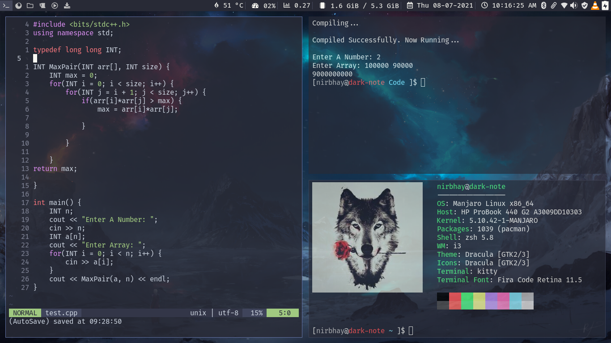
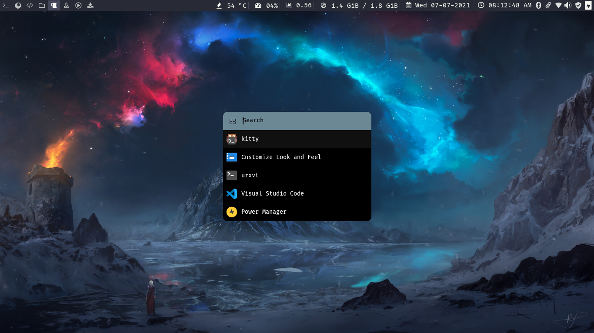
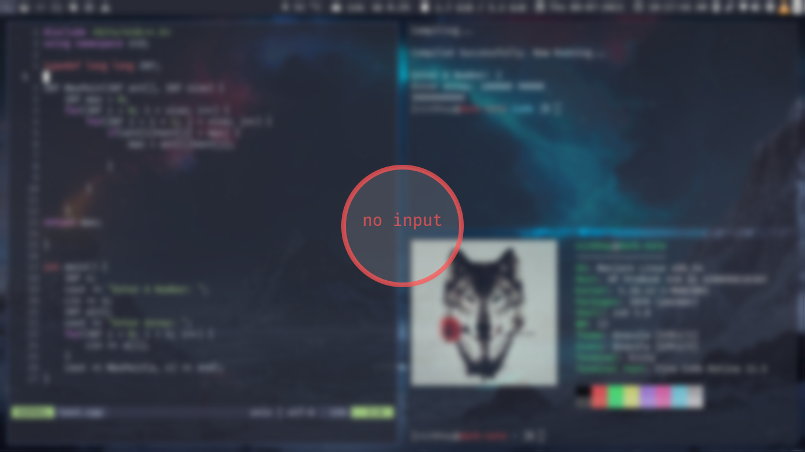

<h1>Alioth dotfiles</h1>

<strong>Alioth is an arch linux rice customized with dracula theme running on manjaro i3 community edition</strong>

   
  
<strong>Screenshots</strong>

  
  
  
  

<h2>Prerequisites</h2>

Install the following packages: 

<li><code>i3lock-color</code></li>
<li><code>i3-status</code></li>
<li><code>rofi</code></li>
<li><code>picom</code></li>
<li><code>neovim</code></li>
<li><code>kitty</code></li>
<li><code>dunst</code></li>
<li><code>ttf-fira-code</code></li>
<li><code>nerd-fonts-source-code-pro</code></li>
<li><code>ttf-font-awesome</code></li>
<blockqoute>Assuming that manjaro i3 community edition is running on the system, most of the above packages might be already installed. To check if the package is installed: <code>sudo pacman -Q | grep <PACKAGE_NAME></code></blockqoute>
<h2>Installation</h2>

<strong>Manual</strong>

<li>Install the requirements.</li>
<li>Clone this repository: <code>git clone https://github.com/Nirbhay-Gaur/dotfiles/master/alioth.git && cd alioth</code></li>
<li>Copy all the files from alitoh directory to $HOME directory: <code>cp * $HOME/</code></li>
<li>Restart your computer for changes to take effect</li>

<strong>Using install.sh</strong>

<li>Install the requirements.</li>
<li>Clone this repository: <code>git clone https://github.com/Nirbhay-Gaur/dotfiles/master/alioth.git && cd alioth</code></li>
<li>Run the installation script: 
<code>
sudo chmod +x install.sh
./install.sh
</code>
</li>
