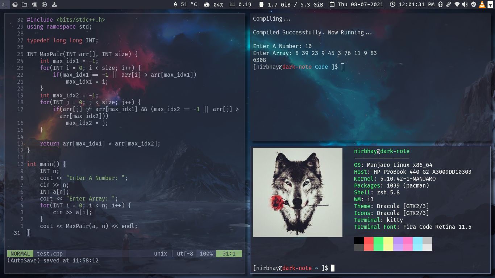

<div align="center">
<h1>Alioth dotfiles</h1>
<p><strong>Alioth is an arch linux rice customized with dracula theme running on manjaro i3 community edition</strong></p>
  <br>
  <p><strong>Screenshots</strong><p>
  
  
  
  
</div>
<h2>Prerequisites</h2>
<p>Install the following packages: </p>
<li>`i3lock-color`</li>
<li>`i3-status`</li>
<li>`rofi`</li>
<li>`picom`</li>
<li>`neovim`</li>
<li>`kitty`</li>
<li>`dunst`</li>
<li>`ttf-fira-code`</li>
<li>`nerd-fonts-source-code-pro`</li>
<li>`ttf-font-awesome`</li>
> Assuming that manjaro i3 community edition is running on the system, most of the above packages might be already installed. To check if the package is installed: `sudo pacman -Q | grep <PACKAGE_NAME>`
<h2>Installation</h2>
<p><strong>Manual</strong></p>
<li>Install the requirements.</li>
<li>Clone this repository: `git clone https://github.com/Nirbhay-Gaur/dotfiles/master/alioth.git && cd alioth`</li>
<li>Copy all the files from alitoh directory to $HOME directory: `cp * $HOME/`</li>
<li>Restart your computer for changes to take effect</li>
<p><strong>Using install.sh</strong></p>
<li>Install the requirements.</li>
<li>Clone this repository: `git clone https://github.com/Nirbhay-Gaur/dotfiles/master/alioth.git && cd alioth`</li>
<li>Run the installation script: 
```
sudo chmod +x install.sh
./install.sh
```
</li>
